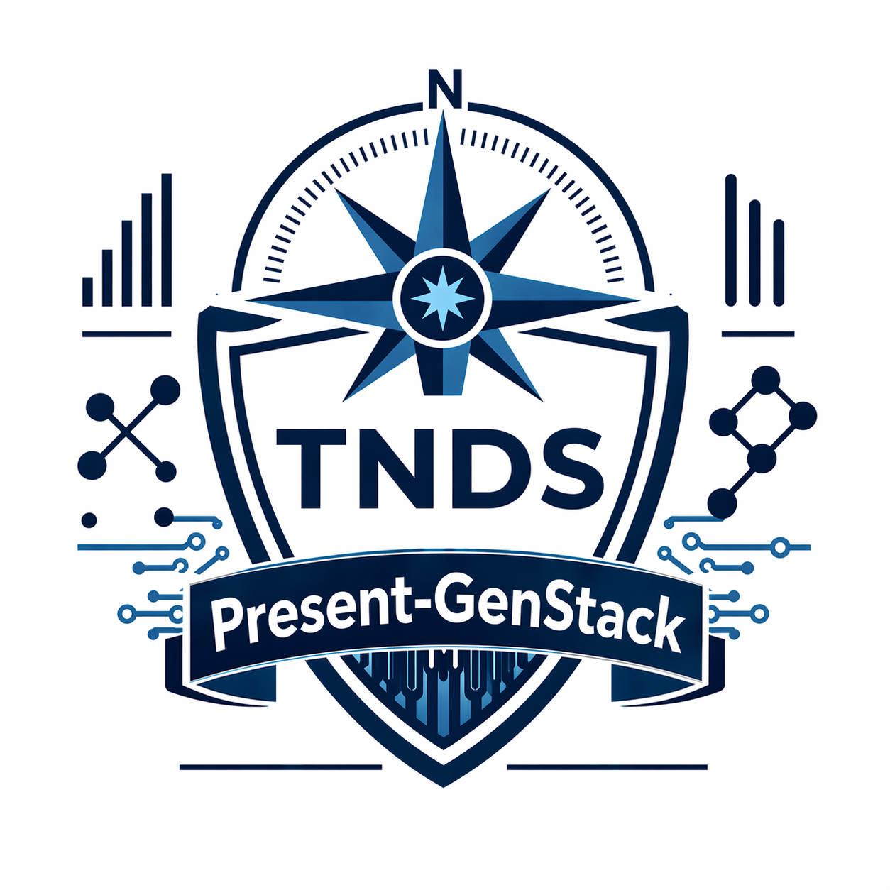

<div align="center">

# present-genstack

### README to HTML Presentation Generator

[](https://www.python.org)
[](LICENSE)
[](https://truenorthstrategyops.com)



</div>

`present-genstack` converts a markdown README into a polished, single-file HTML slide presentation.

## What It Does

- Parses README headings and sections
- Builds presentation slides automatically
- Supports theme configuration via `config.json`
- Outputs browser-ready HTML with keyboard/touch navigation
- Uses Python standard library only

## Quick Start

```bash
python generate_presentation.py
```

Default behavior:
- Input: `README.md`
- Output: `presentation.html`

## CLI Usage

```bash
python generate_presentation.py [readme_path] [output_path] [config_path]
```

Examples:

```bash
python generate_presentation.py README.md presentation.html
python generate_presentation.py docs/README.md HTML_PRESENTATIONS/project-brief.html config.json
```

## Config Example

```json
{
  "date": "April 2026",
  "theme": {
    "primary_gradient": "linear-gradient(135deg, #1e3c72 0%, #2a5298 100%)",
    "accent_color": "#ffd700",
    "secondary_color": "#87ceeb"
  }
}
```

## Recommended README Layout

```markdown
# Project Name

> One-line summary

## Overview
## Features
## Tech Stack
## Installation
## Usage
## Contact
## License
```

## Project Files

```text
present-genstack/
├── generate_presentation.py
├── config.json
├── sample-presentation.html
├── HTML_PRESENTATIONS/
└── README.md
```

## License

MIT (see [LICENSE](LICENSE)).

## Author

Jacob Johnston  
True North Data Strategies LLC  
jacob@truenorthstrategyops.com
